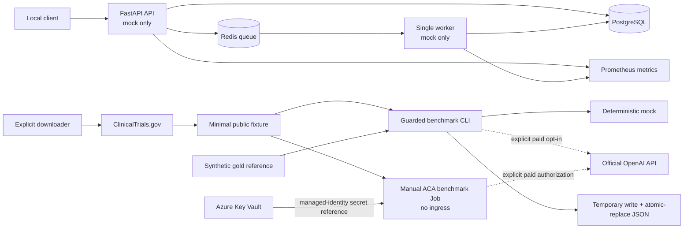

# CriteriaBench

CriteriaBench is a small, auditable engineering project that turns public clinical-trial eligibility text into a typed structure and measures how closely an extractor reproduces a reference. It demonstrates API design, background processing, deterministic evaluation, containers, observability, CI, Kubernetes packaging, infrastructure as code, and guarded LLM use.

> **Not for clinical use.** CriteriaBench is an engineering demonstration, not a medical device. It does not decide whether a person qualifies for a trial and has not been clinically validated.

Last factual review: **2026-09-01**.

## What is implemented

| Area | Current state |
|---|---|
| Extraction contract | Strict Pydantic models cover inclusion/exclusion criteria, category, concept, operator, value/unit, negation, temporal constraints, logic groups, evidence spans, and ambiguities. Cross-field semantic rules are validated. |
| API | FastAPI exposes mock-only sync/async extraction, evaluation, saved runs, service info, health, readiness, OpenAPI, and Prometheus metrics. Paid providers are rejected. |
| Worker and storage | PostgreSQL persistence plus a single Redis worker with atomic claim, acknowledgement, restart recovery, bounded dead-letter storage, frozen job contracts, and fail-closed payload checks. Delivery is **at least once**, not exactly once. |
| Evaluation | Duplicate-safe exact precision/recall/F1, token F1, eight structured-field accuracies, and a macro field score. Alignment uses deterministic maximum-weight one-to-one assignment among same-kind criteria with a 0.25 token-F1 floor. |
| Benchmark | A zero-cost synthetic gold smoke and JSON evidence artifact written through a temporary file and atomic replace. The built-in gold set has one case; it proves the pipeline, not model quality. |
| Paid model path | Available through the guarded local benchmark CLI and a separately guarded, no-ingress manual Azure Container Apps Job. Both pin the reviewed `gpt-5.6-luna` model/rates and official OpenAI endpoint. Two local attempts failed closed on provenance, followed by one successful local smoke; two ACA attempts failed before job start, followed by exactly one successful ACA execution. These are one-case engineering smokes, not model-quality evidence. |
| Data input | A bounded, fixed-host ClinicalTrials.gov downloader maps NCT ID, brief title, eligibility text, and source URL. The worker never downloads studies. |
| Packaging | A non-root multi-stage image consumes `uv.lock` with digest-pinned Python and uv bases. Compose, Kustomize, Helm, and Terraform definitions are present. |
| Automation | GitHub Actions runs frozen static/unit/integration checks, produces the offline benchmark artifact, validates infrastructure, scans the exact image bytes later published, and attests the pushed digest. |

OpenTelemetry traces, API authentication, GitHub-to-Azure OIDC, remote locked Terraform state, end-to-end AKS workload identity, and a production API data plane are future work. The narrow Container Apps benchmark path implements a user-assigned managed identity and Key Vault-backed secret reference.

## How it fits together



The important cost boundary is simple: the web API and worker are always mock-only. A live model can run only through the guarded local CLI or the separately authorized manual Container Apps Job.

## What the smoke benchmark measures

Implemented metrics are:

- exact normalized criterion precision, recall, and F1 (criterion kind is part of the exact key);
- token-overlap F1 after same-kind maximum-weight Hungarian alignment;
- accuracy for category, concept, operator, value, unit, negation, temporal **relation**, and logic **connector**; and
- the macro average of those eight field accuracies.

The current score does not separately measure temporal quantity/unit/reference, evidence similarity, logic-parent topology, or ambiguities. Extractor/provider prediction evidence offsets and quotes are checked against the exact supplied source text. The manually authored gold/reference evidence is typed but is not currently cross-checked against the fixture source. `schema_valid=true` means both typed objects passed validation; it does not mean the extraction is clinically correct.

The bundled reference set contains one synthetic case. A credible model comparison would require a larger frozen corpus, independent annotation and adjudication, fixed sampling/model settings, repeated runs where relevant, confidence intervals, and error analysis.

## Run the local stack safely

Prerequisites are Docker Desktop (Linux containers) and PowerShell.

Use the wrapper, not plain `docker compose`: Compose otherwise discovers a project-root `.env` file implicitly. The wrapper disables that behavior and rejects explicit env-file arguments.

```powershell
.\scripts\compose-safe.ps1 up --build -d --wait
.\scripts\compose-safe.ps1 ps
```

Local endpoints:

- OpenAPI: <http://127.0.0.1:8000/docs>
- liveness: <http://127.0.0.1:8000/healthz>
- dependency readiness: <http://127.0.0.1:8000/readyz>
- Prometheus metrics: <http://127.0.0.1:8000/metrics>

Stop the stack while retaining its named PostgreSQL volume:

```powershell
.\scripts\compose-safe.ps1 down
```

Only use `down --volumes` after confirming that the local database is disposable.

## Run checks and the zero-cost benchmark

Dependencies are frozen in `uv.lock`; see [dependency-lock.md](docs/dependency-lock.md).

```powershell
uv lock --check
uv sync --frozen --extra dev
uv run --frozen --no-env-file ruff check .
uv run --frozen --no-env-file ruff format --check .
uv run --frozen --no-env-file mypy src
uv run --frozen --no-env-file pytest -m "not live and not integration"
```

Run the offline gold smoke to a new artifact path:

```powershell
uv run --frozen --no-env-file python -m criteriabench.benchmark_cli `
  data/synthetic/benchmark_case_001.json `
  --output artifacts/smoke.json
```

Existing artifacts are not overwritten unless `--overwrite` is explicit. The artifact records fixture provenance, extraction and evaluator implementation hashes, provider/model, maximum permitted attempts per case, latency, usage-priced cost, extraction, and evaluation. Canonical synthetic and manifested-live outputs omit the application key and redact absolute machine paths; arbitrary offline input can appear in an artifact, so operators must review it before sharing. The default mock costs USD 0.

## Local Kubernetes and Helm

The supported disposable Kustomize path is:

```powershell
.\scripts\kind-up.ps1
# API: http://127.0.0.1:8080/docs
.\scripts\kind-down.ps1 -Confirmation DELETE-KIND
```

The script builds and loads the locked local image, recreates the migration Job on repeat runs, restarts API/worker pods so a reused tag cannot hide stale code, waits for all workloads, and binds the unauthenticated demo API to loopback only. The in-cluster PostgreSQL and Redis data are disposable.

The Helm chart is independently linted/rendered in CI and can be installed into a local cluster with `demoDependencies.enabled=true`. Those demo dependencies are ephemeral and are not a production database or secret strategy.

## Paid benchmark boundary

The API and worker remain mock-only across CI, Compose, Kubernetes, Helm, and AKS. A source-launched API or worker may inherit an ambient key through `Settings`, but both runtime surfaces enforce mock-only execution and prohibit paid calls. The separate manual Container Apps benchmark Job resolves its key through a user-assigned managed identity and Key Vault secret reference; no key literal is stored in Terraform or the job definition.

A deliberate local live CLI run requires all of the following:

1. `LLM_PROVIDER=openai` in that process;
2. `ALLOW_PAID_CALLS=true` in that process;
3. `OPENAI_API_KEY` supplied privately to that process;
4. `--live`;
5. `--acknowledge-paid-api`;
6. an explicit `--budget-usd` greater than zero and no more than USD 2;
7. a manifest-approved input whose verified bytes are the bytes parsed; and
8. an output beneath the repository `artifacts/` directory.

Inspect the exact current interface before any local run:

```powershell
uv run --frozen --no-env-file python -m criteriabench.benchmark_cli --help
```

The application does not automatically load `.env` files. Never put a key in source, YAML, a Docker argument, shell history, an issue, or an artifact. The CLI's budget and the Container Apps authorization guard are application controls, not provider spending caps: failed or retried calls can still be billable. Verify model pricing against the official [OpenAI model page](https://developers.openai.com/api/docs/models/gpt-5.6-luna) immediately before use and reconcile any result with the provider dashboard.

## Data boundary

Use only public ClinicalTrials.gov text or synthetic content—never patient data, protected health information, credentials, or proprietary corpora. The downloader receives the upstream single-study response transiently, validates its size and returned NCT ID, and retains only NCT ID, brief title, eligibility text, and source URL. It does not currently preserve the upstream API version, update timestamp, or raw-response hash.

See the official [ClinicalTrials.gov API documentation](https://clinicaltrials.gov/data-api/about-api) and [terms and conditions](https://clinicaltrials.gov/about-site/terms-conditions).

## Verification evidence

Verified locally and through explicitly approved Azure proofs on 2026-09-01:

- Ruff, formatting, strict mypy, bytecode compilation, and the complete non-live/non-integration suite pass above the 75% coverage gate.
- Frozen dependency resolution and a digest-pinned production image build/import pass.
- Real PostgreSQL migration upgrade/downgrade/upgrade and repository round-trip pass.
- Real Redis claim, acknowledgement, restart recovery, and poison-message dead-letter behavior pass.
- Compose health/readiness, sync extraction, queued worker extraction, persistence, and metrics pass in mock mode.
- A clean loopback-only kind cluster, non-root PostgreSQL initialization, migration, API, worker, sync/async extraction, persistence, metrics, and teardown pass.
- A separate Helm runtime install, migration, API/worker sync/async smoke, and uninstall pass.
- Helm lint/render, Kustomize render, and Terraform offline format/init/validate pass.
- The synthetic gold smoke reports exact F1 1.0, token F1 1.0, macro field accuracy 0.875, and USD 0 cost.
- After two local provenance failures, one approved guarded local Luna smoke completed one case: 1,083 input and 295 output tokens, usage-priced estimate USD 0.000571, USD 0.0111 of application authorization consumed under a USD 0.02 guard, exact F1 0.5, token F1 0.75, and macro field accuracy 1.0. No zero-provider-billing claim is made for the earlier failures.
- The approved AKS proof applied immutable image `sha256:a23de765a424d74d205f84e4255d572ab5cc79bd7774af034cfa9dca804d8ba2`. Health and readiness were up; sync extraction returned 200; async extraction returned 202 and the worker completed; the result contained one inclusion and one exclusion criterion under schema 1.0 with zero tokens and USD 0 cost; and API and worker metrics were observed.
- The AKS parent and managed-node resource groups and budget were independently confirmed absent after teardown; Terraform retained only data-source entries and temporary proof artifacts were absent.
- A separate no-ingress manual Container Apps Job uses immutable image `sha256:94bb5ca7ebf26a331a202cacd455ce922db954f71697229df5439775f9a5b9ad`, `retries=0`, a 300-second timeout, 0.25 CPU, 0.5 GiB memory, and an identity-backed Key Vault secret reference with no literal key. Its EUR 15 budget alert is delayed notification, not a hard cap.
- After two ACA attempts failed before job start with zero executions and were fully cleaned up, the approved proof produced exactly one `Succeeded` execution with one paid Luna attempt. It recorded 1,083 input and 296 output tokens, usage-priced estimate USD 0.000572, USD 0.0111 of application authorization consumed under a USD 0.02 guard, and latency 5,764.961 ms. The schema was valid; prediction and reference each contained two criteria—one inclusion and one exclusion—and scores were exact F1 0.0, token F1 0.5, and macro field accuracy 1.0.

The successful Container Apps Job remains deployed but idle, with review-by date **2026-09-15**; it is not a public or continuously serving API. Both successful paid results are synthetic one-case engineering smokes of guarded execution, validation, provenance, and evaluation—not clinical evidence, statistically meaningful model-quality evidence, or proof that Luna outperforms another model.

## Documentation

- [Architecture](docs/architecture.md)
- [Benchmark methodology](docs/benchmark-methodology.md)
- [Data use and provenance](docs/data-use.md)
- [Operations runbook](docs/operations-runbook.md)
- [Security, privacy, and cost boundaries](docs/security-cost.md)
- [Learning guide](docs/learning-guide.md)
- [Azure proof environment](infra/azure/README.md)

## Honest portfolio claims

This repository supports claims such as: designed a strict LLM extraction contract; implemented deterministic evaluation and provenance-bound evidence; built mock-only API/worker paths with PostgreSQL and Redis; containerized a non-root service with frozen dependencies; exercised Compose, Kustomize, and Helm locally; added Prometheus observability; executed then destroyed an explicitly approved, mock-only AKS proof using an immutable image digest; and deployed a bounded, no-ingress manual Container Apps benchmark Job with managed identity, a Key Vault secret reference, and one successful guarded synthetic Luna execution.

It should not be described as clinically validated, production-ready, exactly-once, publicly secure, a public or continuously serving production API, proven to outperform another model, backed by statistically meaningful model-quality evidence, or protected by a hard Azure or OpenAI spending cap. Current Azure status should be stated precisely: the AKS proof was destroyed, while one manual Container Apps Job remains deployed but idle pending its 2026-09-15 review.

Licensed under the [MIT License](LICENSE).
