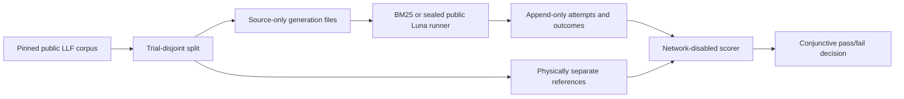

# CriteriaBench

CriteriaBench is a reproducible benchmark for turning real clinical-trial eligibility criteria into structured logical forms. Real v1 contains **2,000 human-annotated criteria from 885 ClinicalTrials.gov trials**. Its frozen split has **200 development cases from 86 trials** and **1,800 locked-test cases from 799 different trials**; no trial appears in both splits.

The data, safe parser, evaluator, retrieval baseline, human-agreement analysis, and guarded live runner are implemented. The public runner was used for two sealed 25-case development configurations: `gpt-5.6-luna` at `none` and `medium` reasoning. A separately sealed local diagnostic harness ran `gpt-5.6-terra` at `medium` on the identical source-only subset. All three runs completed. The 1,800-case locked test has not run. Raw provider responses, credentials, per-case predictions, and scored reports are intentionally not published.

> **Research and engineering only.** CriteriaBench is not a medical device, patient-matching system, or clinical decision tool. It evaluates structural reproduction of public annotations.

Last factual review: **2026-09-03**.

## Real v1 at a glance

| Area | Implemented evidence or status |
|---|---|
| Public corpus | Leaf Logical Forms (LLF), pinned to upstream commit `461288aeba8b37fabd43bd7c55f0e1cb1bb10b9e`: 2,000 primary criteria, 885 trials, and 60 additional annotations over 20 agreement cases |
| Reference coverage | 1,997 available primary logical forms parse successfully; three missing upstream references remain explicitly counted rather than fabricated or dropped |
| Split | 200 development / 1,800 locked test, grouped by NCT trial; prompt examples and every manually exposed reference are forced into development |
| Leakage boundary | Paid generation can mount only source-only cases, split assignments, and a source-only manifest. Development and test references live in separate files and are mounted only by the corresponding offline scorer |
| Safe semantics | A bounded Python-AST allowlist converts inert LLF text to a canonical flat node table. It never compiles, evaluates, executes, imports, or invokes the annotation code |
| Retrieval baseline | Deterministic polarity-matched BM25 over development references. On all 200 development cases with the target trial excluded: 8 exact trees, node F1 `0.369699`, edge F1 `0.213939`, and combined node-plus-edge F1 `0.293919` |
| Frozen 25-case comparator | The preregistered development canary subset gives BM25 1/25 exact and combined node-plus-edge F1 `0.202918` |
| Human agreement | 20 cases × 3 annotations; 57/60 annotations parse, yielding 54/60 pairs. Case-macro exact agreement is `0.466667`, node F1 `0.879308`, edge F1 `0.788692`, and typed-component F1 `0.880009`; 7/20 cases have full three-way exact consensus |
| Live model comparison | Two sealed Luna configurations from the public runner and one separately sealed local Terra diagnostic completed on the same 25-case source-only subset. Each used direct structured-output generation followed by local bounded parsing and offline evaluation; no locked-test result or public production service is claimed |
| GraphV2 | A future product/evidence contract. Paid GraphV2 execution is structurally disabled and is not part of Real v1 |
| Synthetic suite | Preserved as a deterministic legacy regression for old application plumbing; it is not headline model-quality evidence |

The full-development BM25 numbers are descriptive development evidence, not a held-out estimate. The completed 25-case runs are development diagnostics, not held-out performance estimates.

## What the benchmark asks

Given a criterion such as:

> No history of severe asthma requiring systemic corticosteroids.

the system must reproduce the annotation's logical structure: calls, method chains, symbols, string and Boolean literals, tuples, and their parent-child relationships. It is not enough to emit plausible prose.

The model receives only the criterion text, its inclusion/exclusion kind, the frozen prompt, and the strict response schema. It receives no reference logical form, neighbouring annotation, web tool, or scorer feedback. Trusted local code attaches case identity and source hashes outside the model response.

The primary score is micro F1 over canonical LLF nodes and edges. Exact canonical-tree match and separate call, method-attribute, symbol, string, and Boolean scores make partial correctness inspectable. A timeout, refusal, invalid response, duplicate response ID, or other failed case is retained and scored as an empty prediction where a reference exists.

See [Benchmark methodology](docs/benchmark-methodology.md) and the frozen [Real-v1 protocol](docs/real-v1-protocol.md).

## Why the evidence is stronger than a demo



The benchmark separates prediction from scoring at both the file and process boundary. The public corpus, code, prompt, model settings, price snapshot, exact container image, case set, plan, execution binding, and authorization are hash-linked before a paid request. These hashes are reproducible internal lineage controls; they are **not** cryptographic attestation by the model provider.

Human agreement provides context for annotation variability. It is not a model ceiling and does not establish clinical correctness.

## Completed live development comparison

The public runner produced the Luna-`none` and Luna-`medium` runs. Terra-`medium` used a separately sealed local diagnostic harness that is not included in this public repository. All three used the same preregistered 25-case development subset: 25 distinct trials, no prompt-example trials, balanced by criterion kind and source length. Across the three configurations, all 75 planned calls completed with known usage, zero application retries, and no application-cap breach.

The configurations differ in model family, reasoning effort, and output ceiling, so the comparison cannot isolate a single causal factor. Automated structural scoring was supplemented by exploratory model-based semantic review with the per-case candidate identity mapping hidden. These are development diagnostics, not held-out or production-performance estimates.

Advancement requires every frozen gate to pass together:

- exactly 25 attempted and completed cases, with no failure, fatal abort, or unattempted case;
- known usage, observed latency, a unique response ID, and the required returned provider identity for every case;
- no more than one attempt per case and no retries;
- p95 latency at most 60 seconds and charged authorization consumption at most the exact sealed profile cap;
- combined node-plus-edge F1 at least `0.50` and at least `0.10` above the frozen BM25 comparator; and
- at least 2 exact canonical-tree matches.

Failure of any frozen gate prohibits the locked run. Only the locked-compatible Luna-`none` profile can be used for advancement; the `medium` configurations are development diagnostics and cannot supply that permission, even if their operational and quality checks pass. A new or changed configuration requires a new versioned preregistration rather than repeated sampling until a favourable result appears.

The locked-test lane remains unexecuted. Any future locked run requires refreshed official pricing, a mechanically sufficient plan and validity window, and separate explicit user authorization; none of the completed development diagnostics constitutes that authorization.

The requested model name is an alias and can change behind the same name. Artifacts record requested and returned model identity, response object, service tier, usage, latency, response-ID hashes, and pricing assumptions. Provider-dashboard reconciliation remains an independent required check.

See [Operations runbook](docs/operations-runbook.md) and [Security, privacy, and cost](docs/security-cost.md).

## Reproduce the offline evidence

The repository uses a frozen `uv.lock`. The Real-v1 checks make no provider call and need no API key:

```powershell
.\.tools\uv\uv.exe lock --check
.\.tools\uv\uv.exe sync --frozen --extra dev
.\.tools\uv\uv.exe run --frozen --no-env-file pytest `
  tests/test_llf_import.py `
  tests/test_llf_semantics.py `
  tests/test_llf_semantic_evaluation.py `
  tests/test_llf_baselines.py `
  tests/test_llf_agreement.py `
  tests/test_llf_canary_preregistration.py `
  tests/test_llf_live_score.py
```

The public evidence artifacts include:

- [human-agreement analysis](docs/results/llf-human-agreement.json);
- [full parser coverage](docs/results/llf-semantic-coverage.json);
- [development coverage](docs/results/llf-semantic-coverage-development.json); and
- [locked-test coverage](docs/results/llf-semantic-coverage-test.json).

No Azure login was needed for the direct model runs. For each run, the operator entered the API key at a hidden PowerShell prompt; the wrapper passed it only to the container process over standard input. The key was never an argument, file, Docker environment value, committed dotenv value, or artifact.

## Legacy application and deployment engineering

The repository also contains a FastAPI/PostgreSQL/Redis mock extraction service, Prometheus metrics, Docker Compose, Kustomize/kind, Helm, Terraform, and GitHub Actions. API and worker paths are mock-only and should remain local or private because the API is unauthenticated.

On 2026-09-01, the project separately validated its infrastructure with one local and one no-ingress Azure Container Apps synthetic Luna smoke, plus an ephemeral mock-only AKS deployment that was destroyed after verification. Those dated exercises support claims about guarded execution, containers, queues, health checks, identity-backed secret references, and teardown. They do **not** support a Real-v1 quality result, clinical validation, or a public production service claim.

Run the local mock stack with the safe wrapper:

```powershell
.\scripts\compose-safe.ps1 up --build -d --wait
.\scripts\compose-safe.ps1 ps
```

Local OpenAPI is at <http://127.0.0.1:8000/docs>. Stop without deleting the database volume with `./scripts/compose-safe.ps1 down`.

## Interpretation limits

- LLF is a public benchmark and may have appeared in model pretraining. Real v1 measures reproducible public-benchmark performance with no runtime gold leakage; it is not contamination-resistant generalization.
- The locked test is public, not a substitute for a fresh temporal holdout.
- The 20 agreement cases are selected and small. Their values measure annotation consistency, not correctness.
- Three primary references are missing upstream; they stay in operational accounting but not semantic scoring.
- Structural LLF similarity is not patient-level eligibility accuracy.
- No result makes the API safe to expose publicly or suitable for clinical use.

A stronger future extension would use newly collected post-cutoff trials, independent double annotation, biomedical adjudication, and a frozen temporal holdout. That extension is not implemented.

## Documentation

- [Real-v1 protocol](docs/real-v1-protocol.md)
- [Benchmark methodology](docs/benchmark-methodology.md)
- [Architecture](docs/architecture.md)
- [Operations runbook](docs/operations-runbook.md)
- [Data use and provenance](docs/data-use.md)
- [Security, privacy, and cost](docs/security-cost.md)
- [Reproducible dependencies](docs/dependency-lock.md)
- [Learning guide](docs/learning-guide.md)
- [Legacy Synthetic v0.1.1 report](docs/results/synthetic-v0.1.1.md)
- [Historical immutable Synthetic v0.1 report](docs/results/synthetic-v0.1.md)

## Honest portfolio summary

> Built a trial-disjoint benchmark over 2,000 real human-annotated clinical-trial criteria, including a no-exec semantic parser, deterministic BM25 comparator, human-agreement analysis, physically isolated references, structural scoring, and sealed live LLM evaluation across three development configurations. Separately validated the containerized mock API/worker stack on ephemeral AKS and a no-ingress Container Apps synthetic-model smoke job.

This supports benchmark, evaluation, and cloud-delivery claims. It does not support claims of model superiority, contamination-resistant generalization, public production deployment, or clinical validity.
