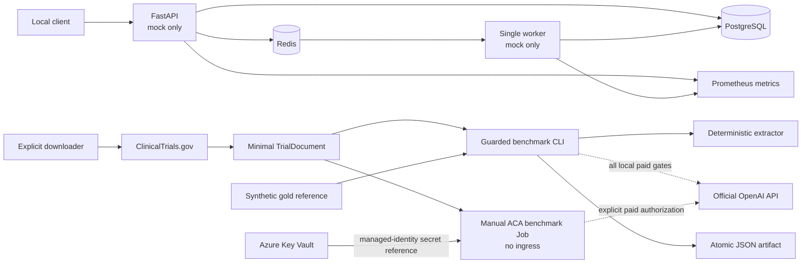
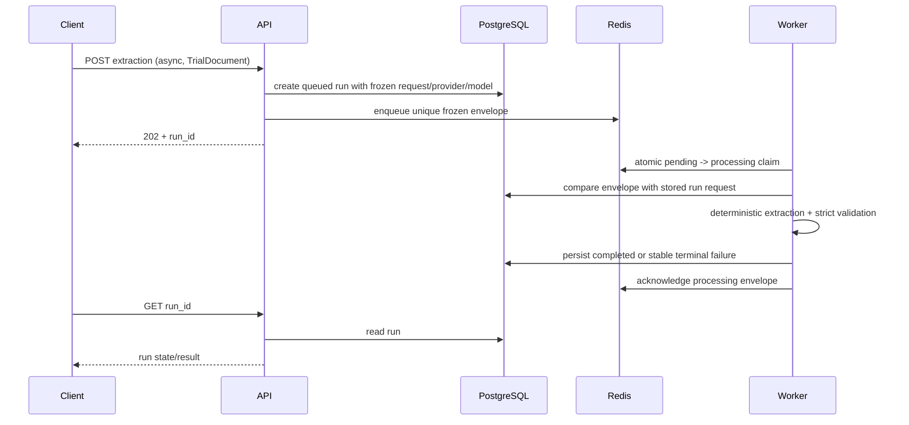

# Architecture

CriteriaBench separates ordinary zero-cost service operation from deliberate paid benchmarking. This page describes the implemented architecture as of 2026-09-01.

## System view

The downloader and paid benchmark paths are separate operator paths. The worker never fetches ClinicalTrials.gov, never evaluates a result, and never calls a paid model. The supported paid surfaces are the guarded local CLI and the separately authorized manual Container Apps Job.

## Application responsibilities

### FastAPI API

The API exposes:

- `/healthz`, `/readyz`, `/metrics`, and `/docs` (documentation is disabled in production mode);
- `/api/v1/info`;
- synchronous mock extraction;
- asynchronous mock extraction via Redis;
- evaluation linked to a completed stored extraction;
- smoke benchmark orchestration; and
- saved-run retrieval.

It validates all request objects, stores runs in PostgreSQL, and rejects any resolved non-mock provider. It is unauthenticated and therefore supported only on loopback or a trusted private network.

### Redis worker

The supported worker count is one. A queued envelope freezes:

- run ID and exact `TrialDocument`;
- provider and model labels;
- schema version; and
- an implementation/schema contract hash.

The worker atomically moves an envelope from pending to processing, checks it against the current mock contract and the exact stored database request, performs deterministic extraction, validates the result/evidence, persists the terminal state, then acknowledges the envelope. It moves malformed envelopes to a bounded dead-letter list. On restart it returns stranded processing items to pending.

These are at-least-once semantics. Redis and PostgreSQL do not participate in one transaction, so exactly-once processing is not claimed.

### PostgreSQL

PostgreSQL stores the trial request, provider/model, run state, validated extraction JSON, usage/latency/cost fields, and linked evaluation output. The database does not automatically store upstream ClinicalTrials.gov API metadata, a dataset version, a source-response hash, or a Git revision; benchmark artifacts carry their own narrower provenance.

SQLite is used for fast unit tests. Real PostgreSQL migration/repository tests are a separate integration gate.

### Benchmark CLI

The local CLI is one paid-capable surface. Mock mode accepts a caller-provided fixture. Live mode requires a repository-manifested fixture and hashes and parses the same single read. Both modes perform sequential extraction, optionally evaluate a gold reference, and write a temporary artifact before atomically replacing the requested output; live mode additionally applies whole-batch retry-aware cost preflight.

Local live use additionally pins the official OpenAI host, reviewed Luna model/rates, output directory, explicit paid flags, and a run budget no greater than USD 2. API and worker paths remain mock-only.

### Container Apps benchmark Job

The other paid-capable surface is a no-ingress, manually triggered Azure Container Apps Job. It is pinned to immutable image `sha256:94bb5ca7ebf26a331a202cacd455ce922db954f71697229df5439775f9a5b9ad`, runs with 0.25 CPU and 0.5 GiB memory, has `retries=0` and a 300-second timeout, and resolves the OpenAI key through a user-assigned managed identity and Key Vault secret reference rather than a literal in Terraform or the job definition. Its USD 0.02 guard is application authorization, not an account cap.

The successful proof produced exactly one `Succeeded` execution and the job remains deployed but idle, tagged for review by 2026-09-15. It has no ingress and is not a continuously serving API.

### ClinicalTrials.gov downloader

The downloader accepts one or more validated NCT IDs and processes each one at a time. For each ID it calls the fixed official host without redirects, bounds the streamed response, validates the returned identifier, then maps only NCT ID, brief title, eligibility text, and source URL. It is not part of an API request or worker job.

## Async lifecycle

Evaluation is a separate operation. When linked to a run, the run must be completed, contain a valid stored result, match the trial, and equal the submitted prediction exactly.

## Evaluation architecture

Exact normalized duplicate-aware counts independently produce precision/recall/F1. Separately, token and field metrics use token-F1 weights in a deterministic Hungarian maximum-weight one-to-one assignment among same-kind prediction/reference criteria; pairs below 0.25 do not contribute. Aligned-pair token and eight field scores are divided by `max(prediction_count, reference_count)`, so missing and extra criteria contribute zero.

This is an engineering smoke metric. It does not score evidence similarity, temporal quantity/unit/reference, logic-parent topology, or ambiguities. Extractor/provider prediction evidence is separately checked against source text; manually authored gold/reference evidence is typed but is not currently source-cross-checked.

## Operational endpoints and metrics

The API exports bounded-label counters/histograms for HTTP requests, extraction outcomes, tokens, latency, usage-priced cost, and evaluations. The worker exposes its metrics on port 9090 inside the local network/cluster. Raw trial IDs, URLs, source text, exception messages, and job IDs are not labels.

Prometheus support is implemented. OpenTelemetry application traces and a trace backend are future work.

## Packaging and deployment

### Docker and Compose

The multi-stage image consumes `uv.lock`, pins Python/uv base digests, installs runtime-only dependencies, and runs as UID/GID 10001. Compose runs PostgreSQL, Redis, one migration container, API, and worker; optional observability is profile-gated. Only the API is published, on `127.0.0.1:8000`.

Routine Compose commands go through `scripts/compose-safe.ps1` to prevent dotenv/alternate-file discovery.

### Kustomize and kind

Raw manifests are deployed through the kind overlay. Demo database/Redis credentials and services exist only in that disposable overlay. `scripts/kind-up.ps1`:

1. builds and loads the current locked image;
2. creates/reuses the exact cluster;
3. deletes the old migration Job;
4. applies Kustomize;
5. restarts API/worker so a reused local tag cannot stay stale; and
6. waits for PostgreSQL, Redis, migration, API, and worker.

The API mapping is loopback-only at port 8080. kind is development evidence, not proof of network-policy enforcement or production security.

### Helm

The Helm chart templates the same application with digest-addressable images, a migration Job, startup gates, one Recreate worker, security contexts, metrics service, and NetworkPolicies. `demoDependencies.enabled=true` creates an ephemeral non-root PostgreSQL/Redis pair and a random namespace-local credential. Outside a demo, an existing database Secret is required.

### Azure definitions

The AKS Terraform definition creates a short-lived mock proof: free control-plane SKU, one bounded node, Azure CNI Overlay/Cilium, Microsoft Entra/Azure RBAC configuration, explicit parent and managed-node resource groups, TTL metadata, and combined budget alerts. The supported scripts bind apply to an expiring reviewed plan hash and immutable GHCR digest, and verify both resource groups after destroy.

An explicitly approved ephemeral mock-only AKS proof was applied on 2026-09-01 with immutable image `sha256:a23de765a424d74d205f84e4255d572ab5cc79bd7774af034cfa9dca804d8ba2`. AKS health and readiness were up; sync extraction returned 200; async extraction returned 202 and the worker completed; the result contained one inclusion and one exclusion criterion under schema 1.0 with zero tokens and USD 0 cost; and API and worker metrics were observed.

Teardown was independently confirmed: the AKS parent and managed-node resource groups and budget were absent, Terraform retained only data-source entries and no managed resources, and temporary proof artifacts were absent. The AKS proof was not a production deployment.

The Container Apps Terraform definition creates one no-ingress manual Job, a Consumption environment, a user-assigned managed identity, RBAC-backed Key Vault secret access, and a delayed EUR 15 budget alert. The job is pinned to the immutable digest and bounded resources described above. Two earlier deployment attempts failed before job start, produced zero executions, and fully cleaned up. The successful deployment produced exactly one `Succeeded` execution and remains idle pending the 2026-09-15 review.

That execution made one Luna attempt and recorded 1,083 input and 296 output tokens, usage-priced estimate USD 0.000572, USD 0.0111 of application authorization consumed under a USD 0.02 guard, and latency 5,764.961 ms. The schema was valid; prediction and reference each contained two criteria—one inclusion and one exclusion—and scores were exact criterion-text F1 0.0, token F1 0.5, and macro field accuracy 1.0. This is a synthetic one-case engineering smoke of the cloud execution path, not clinical or statistically meaningful model-quality evidence.

Current execution uses a local Azure CLI/Terraform operator identity and local Terraform state. Container Apps Key Vault integration and its user-assigned managed identity are implemented; GitHub-to-Azure OIDC, remote locked state, end-to-end AKS workload identity, and a full production API identity design remain future work. The EUR 15 Azure alert is delayed notification, not a hard cap or automatic cleanup.

## Failure behavior

| Failure | Implemented response |
|---|---|
| Invalid API request or linked extraction reference | Reject before the corresponding extraction/evaluation insert |
| Provider/prediction evidence mismatch | An extraction run may already be persisted; reject the result, mark the run failed, and store no valid output |
| Redis unavailable at enqueue | Return a safe service error; do not report queued success |
| Worker crashes after claim | Item remains processing and is recovered when the single worker restarts |
| Malformed envelope | Atomic move to a dead-letter list capped at 100 |
| Job contract or stored-request mismatch | Stable terminal failure, no extraction call, then acknowledge |
| Provider budget blocked | Reject before creating a paid run/call |
| Provider failure after call starts | Treat conservative reservation as consumed; write only safe error type/status |
| Container Apps deployment fails before success | Start no paid job execution and automatically clean up billable resources; ordinary cleanup does not purge a soft-deleted Key Vault |
| ClinicalTrials response too large/mismatched | Raise a safe downloader error |

There is no general delayed retry/backoff scheduler. The OpenAI SDK has bounded retries, and the authorization ledger reserves for all permitted attempts. The Container Apps Job separately sets platform retries to zero.

## Deliberate limitations

- one worker replica;
- unauthenticated local/private API;
- demo data services are ephemeral and not backed up;
- one synthetic gold reference;
- no clinical validation or patient matching;
- no public or continuously serving production API, TLS, retention system, or full production identity design;
- no OpenTelemetry evidence;
- one manual no-ingress Container Apps Job is currently deployed but idle, not a production-readiness claim; and
- successful live evidence is limited to one local and one Container Apps synthetic one-case smoke and does not establish model quality or clinical validity.
