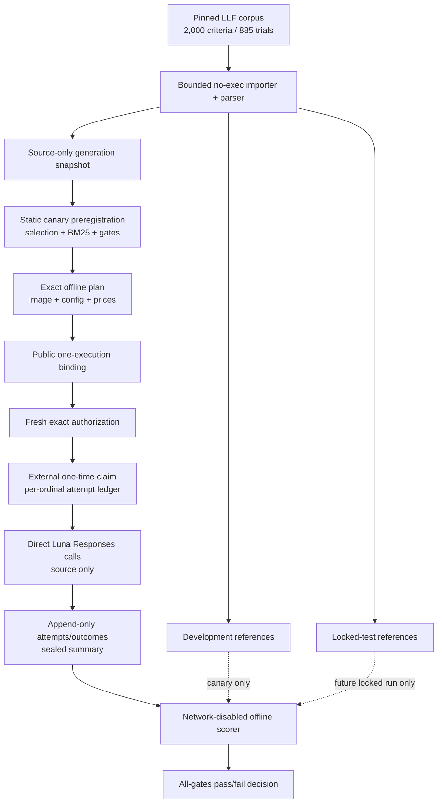
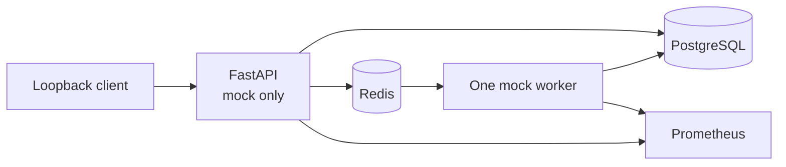

# Architecture

CriteriaBench has two deliberately separate planes:

1. the **Real-v1 benchmark plane**, which is the current model-evaluation work; and
2. the **legacy mock application plane**, which demonstrates API, queue, database, container, Kubernetes, and cloud plumbing without serving a paid model.

Neither plane is a clinical or public production service.

## Real-v1 benchmark plane

### Import and semantic layer

The upstream JavaScript files are data, not programs. The importer decodes three bounded string literals and never executes JavaScript. A second bounded Python-AST allowlist converts each LLF expression to an inert canonical flat node table without compiling, evaluating, importing, or invoking it.

The semantic layer owns:

- strict LLF node/reference/output models;
- canonicalization limited to documented commutative constructs;
- exact, node, edge, and typed-component comparison;
- full and split-specific parser-coverage artifacts;
- physical loading of source-only or split-reference files; and
- safe empty-prediction treatment for operational failures.

All 1,997 available primary references parse. The three missing upstream references remain visible in operational counts.

### Generation and reference isolation

The generation snapshot contains 2,000 public source criteria and trial-level split assignments. Its manifest omits reference availability, missing-reference identities, semantic counts, and reference hashes.

The development and test logical forms are different physical files. A generation process cannot receive either. The development scorer cannot open the test-reference path. The locked scorer, if later authorized, must use a separate test-only mount after prediction sealing.

This boundary prevents accidental runtime gold access; it does not prevent a model from having seen the public corpus during pretraining.

### Baseline and preregistration

The BM25 baseline is deterministic, zero-network, and development-trained. Development predictions exclude the target's entire trial. Test predictions can use development references only.

The static canary preregistration binds:

- the complete development generation/reference inputs;
- the deterministic 25-trial selection;
- BM25 identity, predictions, and metrics;
- prompt, provider wire schema, local parser, evaluator, and implementation hashes;
- exact Luna request settings and token reservation;
- the pricing snapshot and exact sealed profile cap; and
- every conjunctive advancement gate.

It records that no model, network, secret, or locked-test reference was used to build it.

### Plan, execution binding, and authorization

An exact plan is created inside the same immutable container image that would execute it, with networking disabled. It binds the selected case order, dataset, prompt/output/parser identity, complete runner implementation, dependency lock, SDK version, model configuration, rate snapshot, token reservations, expiry, and image ID.

The public execution binding then joins that plan to one intended run and authorization. It also binds normalized host output and durable authorization-state paths. It declares one execution, prohibits optional stopping, and records the mandatory policies for quality failure and operational rerun.

Fresh authorization is a separate offline operation. It repeats the preregistration, execution-binding, plan, path, run, case, cap, expiry, and exact-acknowledgement bindings. An authorization for one root, run ID, or image cannot be copied to another.

### Paid runner

The only Real-v1 provider transport calls the official OpenAI Responses endpoint for `gpt-5.6-luna`. It uses a custom HTTP client with environment/proxy trust and redirects disabled. Both sealed profiles use `store=false`, service tier `default`, no tools, zero SDK/application retry, and sequential execution. The historical/default and locked-compatible `none` profile uses 2,048 maximum output tokens and a 60-second application deadline. The versioned development-only `medium` profile uses 32,768 maximum output/reasoning tokens and a 240-second application deadline; it cannot advance the locked-none lane.

The provider wire is only `{logical_form: string}`. Local code applies stricter byte/character limits and parses the LLF. Trusted code attaches ordinals, case identity, hashes, timing, usage, and safe provider provenance.

The PowerShell wrapper obtains the API key through a hidden `SecureString` prompt and streams it over standard input to the one container process. The container receives no key file, command argument, Docker environment value, or dotenv mount.

### Durable single-use state

Paid state is split between:

- a run output directory containing the sealed plan, authorization, local consumption, pending request, per-ordinal attempts/outcomes, and terminal summary; and
- a durable authorization-state directory outside the run tree containing the exclusive authorization claim and append-only per-ordinal attempt claims.

Both roots and their expected hashes are bound before execution. The external claim and local consumption file are a pair: both absent permits first use; both present and equal permits recovery; only one present fails closed. Deleting or copying the output cannot make the external authorization reusable.

Before each call, the runner verifies freshness for the exact number of remaining cases, creates the external ordinal claim, and writes the matching pending request. An interrupted pending request becomes an explicit failed outcome during recovery. A prior fatal outcome seals an aborted summary before another call. Duplicate response IDs and incomplete returned provider identity are fatal contract failures.

Writes use exclusive creation or temporary-write/atomic-replace patterns as appropriate. The implementation does not claim filesystem `fsync` durability or cryptographic attestation from the provider.

### Offline scorer and decision

Scoring runs in the exact image with Docker networking disabled. The scorer imports no OpenAI SDK, HTTP, or transport module. It mounts the sealed run read-only, one split's source/reference artifacts read-only, and a disjoint report output directory.

Before scoring, it reproduces and cross-checks the full plan, preregistration, execution-binding, authorization, claim/consumption, request, attempt, outcome, and summary chain. It rejects unknown direct children, symlinks, filename/ordinal mismatch, duplicate IDs, changed request hashes, missing terminal artifacts, or a reference/case-set mismatch.

The decision evaluator compares the report to the preregistered gates and computes one conjunction. There is no manual override to PASS.

### GraphV2 boundary

The repository contains a typed `EligibilityGraphV2` design for future product/evidence work. It has no independently annotated Real-v1 reference set. Its paid planning path is disabled, and it is not part of the direct LLF result.

## Legacy mock application plane

### API and worker

The FastAPI service exposes health, readiness, OpenAPI, service information, synchronous/queued mock extraction, deterministic evaluation, saved-run retrieval, and Prometheus metrics. It rejects any resolved non-mock provider. It is unauthenticated and supported only on loopback or a trusted private network.

The single Redis worker uses atomic pending-to-processing claim, explicit acknowledgement, startup recovery, a bounded dead-letter list, and frozen request/provider/model/schema/code contracts. PostgreSQL and Redis are not one transaction, so the supported claim is at-least-once delivery with fail-closed validation and best-effort idempotency—not exactly once.

### Packaging

The multi-stage image consumes `uv.lock`, pins base-image digests, installs runtime-only dependencies, and runs as UID/GID 10001. Compose launches PostgreSQL, Redis, migration, API, and one worker; only the API is published, on `127.0.0.1:8000`. `scripts/compose-safe.ps1` prevents implicit dotenv or alternate-compose-file discovery.

Kustomize/kind and Helm package the same mock-only application. Their in-cluster PostgreSQL and Redis options are disposable demonstrations, not durable or production data services. NetworkPolicy rendering does not prove enforcement by every CNI.

## Dated infrastructure evidence

On 2026-09-01, an explicitly approved mock-only AKS proof exercised health/readiness, sync and async mock extraction, worker completion, persistence, metrics, and teardown. Both the parent and managed-node resource groups were independently confirmed absent afterward.

A separate no-ingress Azure Container Apps Job demonstrated one bounded synthetic Luna execution with a user-assigned managed identity and Key Vault secret reference. It was an earlier one-case transport/provenance smoke, not Real-v1 quality evidence or a public service.

These artifacts remain useful demonstrations of container, Terraform, managed-identity, secret-reference, and cleanup engineering. They do not authorize or execute the Real-v1 canary. Direct Real-v1 inference requires no Azure login.

## Trust and claim boundaries

- Public LLF text only; no patient or private input.
- No runtime reference mount in paid generation.
- No paid provider in API, worker, CI, Compose, kind, Helm, or AKS service paths.
- No claim that repository hashes attest to provider behavior.
- No claim that a requested model alias identifies immutable weights.
- No claim that public-benchmark performance is contamination-resistant.
- No public API, multi-tenant security, clinical validation, or production-service claim.

See [Security, privacy, and cost](security-cost.md) for failure and operator boundaries.
