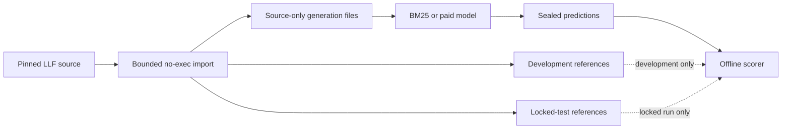

# Data use and provenance

CriteriaBench Real v1 uses public clinical-trial eligibility text and public research annotations. It must not receive patient records, protected health information, credentials, private documents, proprietary corpora, or unpublished clinical data.

## Real-v1 source and license

The benchmark redistributes a deterministic import of Leaf Logical Forms (LLF) annotations from the University of Washington BioNLP [`leaf-corpora`](https://github.com/uw-bionlp/leaf-corpora) repository at commit [`461288a`](https://github.com/uw-bionlp/leaf-corpora/commit/461288aeba8b37fabd43bd7c55f0e1cb1bb10b9e).

- The annotation code/data is distributed under the upstream MIT notice preserved in `data/real/llf/LICENSE.upstream.txt`.
- The underlying eligibility criteria derive from the LCT corpus. Its [data descriptor](https://doi.org/10.1038/s41597-022-01521-0) and Creative Commons Attribution 4.0 license must be respected.
- The LLF task is described in the [LeafAI publication](https://pmc.ncbi.nlm.nih.gov/articles/PMC10654856/).

The repository's complete notice is [data/real/llf/ATTRIBUTION.md](../data/real/llf/ATTRIBUTION.md).

CriteriaBench does not correct or adjudicate upstream criterion text or logical forms. It converts them to inert JSONL, adds lineage hashes, freezes a trial-disjoint split, and marks absent or malformed upstream rows explicitly.

## Imported content

The pinned import contains:

- 2,000 primary criteria from 885 NCT trials;
- 1,997 available primary logical forms and three files with no logical-form body;
- 60 agreement annotations over 20 selected cases; and
- an inventory of all 2,060 upstream JavaScript files.

NCT identifiers remain in local benchmark metadata so criteria can be traced to their public trial. Paid model payloads do not need those identifiers.

Every source file and generated artifact is hash-bound. These SHA-256 values support reproducible internal lineage; they are not proof supplied or signed by the upstream repository or model provider.

## Physical separation

The generation and scoring planes use different files:

`generation_cases.jsonl` contains case/trial identity, inclusion/exclusion kind, source text, split, and source hash, but no logical form or reference hash. `generation_manifest.json` also omits reference availability and missing-reference identities. The live container mounts only these source-only artifacts and split assignments.

Development and test references are separate direct files. The canary scorer mounts development references only after the live run is terminal and sealed. A future locked scorer would mount test references only after all test outcomes were sealed.

`records.jsonl`, full semantic coverage, and agreement annotations are audit/evaluation inputs. They are never live-generation mounts.

## Data sent to OpenAI

The direct Luna request contains:

- the frozen system/developer instructions and five development-only examples;
- one public criterion's inclusion/exclusion kind and text; and
- a strict response schema requiring one `logical_form` string.

It excludes the reference logical form, case ID, NCT ID, source hash, neighbouring criteria, evaluator result, and previous model feedback. No web or other tool is enabled. The request sets `store=false`, but that flag is not a promise about every provider retention or organizational control. Operators must review the provider's current policy and their account settings before sending data.

Only public research text is allowed even though the input is not secret. The model alias may have encountered the public corpus during training; runtime isolation does not make the benchmark contamination-resistant.

## Secrets are not benchmark data

The OpenAI API key is never a corpus field or artifact. For the Real-v1 run, PowerShell reads it with a hidden `SecureString` prompt and sends it to one interactive container process over standard input. The key must not be placed in:

- chat;
- `.env` or `.env.local`;
- a process or Docker environment variable;
- a command-line argument;
- source, JSON, YAML, Terraform, a Docker layer, or an image;
- logs, screenshots, issues, or result artifacts; or
- shell history.

The repository's agent and container policies prohibit reading or copying dotenv secrets. If exposure is suspected, revoke or rotate the key; deleting visible text does not invalidate it.

## Publication review

Source and reference artifacts are public research data with attribution, but live result directories still require review before publication. Check that they contain only expected direct-child artifacts and no:

- plaintext response identifier when only its hash is intended;
- credential, Authorization header, or provider request dump;
- machine/user path, account email, subscription, tenant, or cloud resource identifier;
- process environment or diagnostic dump;
- temporary/pending partial artifact; or
- private input.

Published reports should identify the dataset version, split, source/case-set hashes, requested and returned model labels, prompt/schema/implementation identity, pricing snapshot, usage coverage, safe failures, and limitations. Provider-dashboard reconciliation should be stated separately; internal artifact hashes are not provider attestation.

## Legacy downloader boundary

The older application includes an explicit ClinicalTrials.gov downloader for public single-study data. It validates NCT IDs, uses the fixed official HTTPS host, rejects redirects, bounds streamed responses to 2 MB, verifies the returned ID, and retains only:

- NCT ID;
- brief title;
- eligibility text; and
- canonical source URL.

The full single-study response exists transiently while mapping and may contain other registry modules, but those modules are discarded. The downloader does not currently record the upstream API version, exact acquisition timestamp, `dataTimestamp`, last update, or raw-response hash, and it does not update Real-v1 automatically.

The API and worker accept an already captured `TrialDocument`; they never fetch ClinicalTrials.gov during a job. Persisted local mock requests have no production retention/deletion policy, so they must also remain public or synthetic.

## Drift and new holdouts

ClinicalTrials.gov entries can change. The frozen LLF snapshot must never be silently refreshed in place. Any replacement dataset needs a new version, retrieval timestamps, raw/source hashes, transformation revision, exclusion log, attribution review, and a new preregistration.

A future contamination-resistant extension should use newly retrieved post-cutoff trials, independent human annotation without model output, and biomedical adjudication. It must remain a distinct dataset rather than overwriting Real v1.
