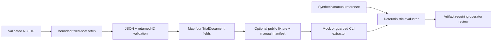

# Data use and provenance

CriteriaBench is limited to public ClinicalTrials.gov text and synthetic developer-created examples. Do not use patient data, protected health information, credentials, proprietary corpora, or other sensitive input.

## ClinicalTrials.gov retrieval

The explicit downloader accepts one or more NCT identifiers and fetches each one at a time. For each identifier, it:

1. validates the identifier format;
2. requests the fixed official ClinicalTrials.gov HTTPS endpoint;
3. rejects redirects;
4. streams the response with a 2 MB ceiling;
5. parses the single-study JSON;
6. validates that the returned NCT ID matches the request; and
7. maps the minimum `TrialDocument` fields.

Retained fields are only:

- NCT ID;
- brief title;
- eligibility text; and
- canonical source URL.

The client receives the upstream single-study response transiently, so other modules may be present in memory during parsing. They are discarded, not persisted, and not sent to an extractor. The current mapper does not project registry fields server-side.

The downloader does not normalize markup, infer demographics, split criteria into a gold structure, or update dataset manifests automatically.

## Fixture provenance

The committed public fixture has a small manual manifest with source identifier, retrieval date, and content hash. The synthetic benchmark manifest records the gold fixture hash/version.

This is sufficient for an engineering smoke, but it is not complete source provenance. The general downloader does not currently record:

- ClinicalTrials.gov API version;
- `dataTimestamp` or last study update;
- exact acquisition time;
- raw upstream response hash;
- transformation/parser revision; or
- an automated manifest entry.

A research dataset should retain those fields, a redistribution/license review, the exact code revision, schema version, exclusion reasons, and a reproducible immutable snapshot.

## Processing boundary

The API/worker path accepts an already captured `TrialDocument`; it does not contact the registry.

## Model data sent

Mock extraction is local and sends nothing to a provider.

Separately approved local and Azure Container Apps live runs have now sent the single synthetic `TrialDocument` JSON, extraction instructions, and strict JSON schema to the provider. The Container Apps run used an embedded, hash-bound copy of that synthetic fixture. No ClinicalTrials.gov contact modules or full upstream registry response were sent. These were one-case engineering-smoke executions within the public/synthetic data boundary; no patient, protected, private, or proprietary data was used.

OpenAI request storage is disabled where supported by the request interface, but operators must still review the provider's current data controls and organizational policy before sending even public text.

## Persistence and publication

API requests with persistence enabled store trial text, extraction state/result, and linked evaluation in the development database. Benchmark artifacts can include arbitrary caller-provided offline fixture content and require operator review before sharing. There is no production retention/deletion policy.

Before publishing a fixture or artifact:

- confirm its input is public or synthetic;
- verify manifest and artifact hashes;
- inspect paths/metadata for machine or account identifiers;
- confirm no credential, header, environment dump, cloud ID, or private data is present;
- retain the source URL/identifier and retrieval note; and
- state whether it is a smoke fixture or research dataset.

## Drift and refresh

ClinicalTrials.gov studies can change. The current repository does not automatically check freshness or drift. A future refresh workflow should compare the upstream last-update/timestamp and raw-response hash, review the mapped diff, version the fixture/manifest, and never silently replace evidence used by an earlier report.

## External terms

Use the official [ClinicalTrials.gov API documentation](https://clinicaltrials.gov/data-api/about-api) and comply with the site's [terms and conditions](https://clinicaltrials.gov/about-site/terms-conditions). Public availability does not remove the obligation to preserve attribution and avoid implying endorsement or clinical validation.
